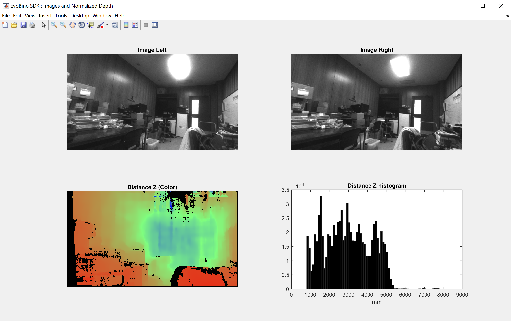
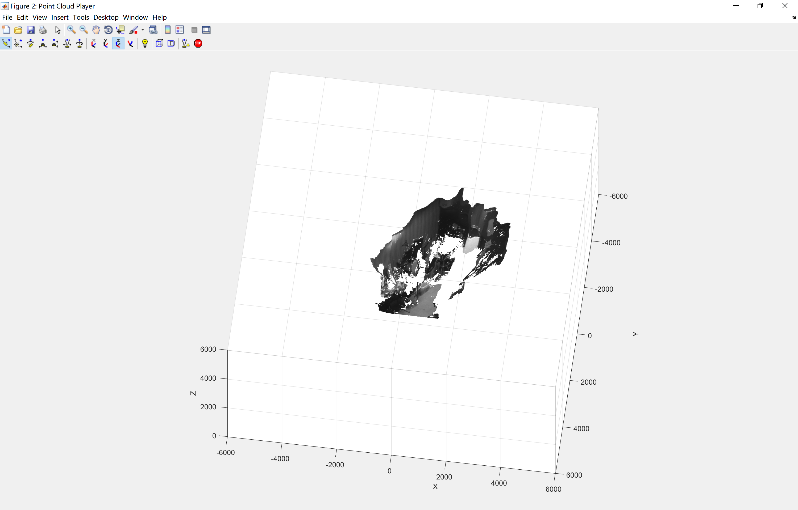

# EvoBinoSDK - Matlab Integration

This sample shows how to use the EvoBinoSDK functions with LeadSense in Matlab.

### Prerequisites

- Windows 7/8/10 x64 (Ubuntu 16.04 x64 untested, but should be the same)
- Matlab with MEX compiler (tested with R2015b version).
- [EvoBinoSDK SDK](http://leadsense.ilooktech.com/developer)
- OpenCV 3.4.1
- CUDA 9.2

## Getting started

- Download the latest version of the EvoBinoSDK on [LeadSense official site](http://leadsense.ilooktech.com/developer).
- For more EvoBinoSDK information, read the [Technical Documents](http://leadsense.ilooktech.com/sdk/docs/).

## Build the program

#### Build for Windows

In CMake GUI:

- Set ‘where is the source code’: ‘leadsense-matlab\src’.
- Set ‘Where to build the binairies’: ‘leadsense-matlab\build’.
- Click ‘Configure’.
	- Make sure to select an x64 version of Visual Studio.
	- You may meet an error: ‘MATLAB not found… nothing will be built.’, manually set the variable ‘MATLAB_ROOT’ with your Matlab path, eg.‘MATLAB_ROOT=C:/Program Files/MATLAB/R2015b’
- Click ‘Generate’.
- Open the Project, make sure the Solution Configuration is 'Release'.
- Build ALL_BUILD.
- Build INSTALL.
- Copy all the EvoBinoSDK dll files and OpenCV dll files to ‘leadsense-matlab\matlab’.

#### Build for Linux

**(Untested)**

## Run the program

In the Matlab directory, go into 'leadsense-matlab\matlab', open the .m file with Matlab and press run.

Press any key to exit the program.

## Features

This sample shows how to use EvoBinoSDK in Matlab.

1. `LeadSense_Camera.m` :

	In this sample, we first initialize the LeadSense Camera and then retrieve both stereo images (Left and Right), the normalized distance z data (8bit), and distance z data (32bits). Then, with Matlab, we compute the depth histogram from the distance z data values and display it.

	

2. `LeadSense_PointCloud.m` :

	In this sample, we first initialize the LeadSense Camera and then retrieve left view, and distance xyz data (32bits). Then, we show the point cloud with pcplayer.

	

	
### Limitations

Since Matlab mxArray has column major order, and evo::Mat has row major order, these sample applications are not designed to run in real time.